#The Math and Statistics Behind DESeq2
This tutorial is meant to be used in conjunction with UConn's RefSeq Differential Expression Tutorial. While the <a href="https://github.com/wolf-adam-eily/refseq_diffexp_funct_annotation_uconn">RefSeq tutorial</a> is ideal for students and researchers needing instructions on common bioinformatical techniques, the reading here is to begin instilling in students and researchers the out-of-the-box mindset and technical skill needed to solve non-traditional biological questions which commonly presents in data. All data used are in this repository and will be downloaded when cloned.

<li><a href="#getting_started">1 Loading data in R and getting started</a></li>
	<li><a href="#how_deseq2_works_1">2 Introduction to DESeq2 -- negative binomial curves</a></li>
	<li><a href="#how_deseq2_works_2">3 Estimating true transcriptome size</a></li>
	<li><a href="#how_deseq2_works_3">4 Reparameterizing the negative binomial distribution</a></li>
	<li><a href="#how_deseq2_works_4">5 Parameter estimation theory: mean and variance</a></li>
	<li><a href="#how_deseq2_works_5">6 Parameter estimation technique: mean and variance</a></li>
	<ol>	<li><a href="#how_deseq2_works_6">6a Cox Reid-Adjusted Likelihood</a></li>
		<li><a href="#how_deseq2_works_7">6b Estimating variance with CRAL</a></li></ol>
		<li><a href="#how_deseq2_works_8">7 Calculating significance of findings</a></li>

<h3 id="getting_started">Loading data in R and getting started</h2>
<pre style="color: silver; background: black;">library("DESeq2")

&num; Set the working directory
directory <- "~/your_directory_with_htseq_counts"
setwd(directory)
list.files(directory)</pre>

We are going to be generating a variety of files. As you learn and continue to do bioinformatic analyses you will see that we are always creating a sequence of files for each of our analyses. You will also find as you continue to work that consistency is the key for efficient completion of your tasks. Consistency is meant in as somewhat catholic -- ideally you will have a base code for type of analysis which reqires minimal change betweeen samples (perhaps only changing variable names and variable set-ups) which outputs files that are named in an easily indexable way. One way to achieve the second objective is to use an "output prefix", which, simply put, is the beginning of your file names generated for each output. For us, we do the following: 

<pre style="color: silver; background: black;">
outputPrefix <- "Croaker_DESeq2"</pre>

For easy loading, let's create a vector with our sample filenames:

<pre style="color: silver; background: black;">
sampleFiles<- c("sort_trim_LB2A_SRR1964642.counts","sort_trim_LB2A_SRR1964643.counts",
                "sort_trim_LC2A_SRR1964644.counts", "sort_trim_LC2A_SRR1964645.counts")
</pre>

Because we will be using DESeq2 for our analysis, it would be helpful to have a clear set of instructions for us to follow. We can do this by browsing the DESeq2 vignette:

<pre style="color: silver; background: black;">??'DESeq2-package'

DESeq2-package {DESeq2}	R Documentation
DESeq2 package for differential analysis of count data

<strong>Description</strong>

<em>The main functions for differential analysis are DESeq and <u>results</u>. See the examples at <u>DESeq</u> for basic analysis 
steps. Two transformations offered for count data are the variance stabilizing transformation, <u>vst</u>, and the "regularized 
logarithm", <u>rlog</u>. For more detailed information on usage, see the package vignette, by typing vignette("DESeq2"), or the 
workflow linked to on the first page of the vignette. All support questions should be posted to the Bioconductor support site: 
http://support.bioconductor.org.</em></pre>

We click on "DESeq" for the basic analysis steps and see this:
<pre style="color: silver; background: black;">
DESeq {DESeq2}	R Documentation
Differential expression analysis based on the Negative Binomial (a.k.a. Gamma-Poisson) distribution

<strong>Description</strong>

<em>This function performs a default analysis through the steps:

estimation of size factors: <u>estimateSizeFactors</u>

estimation of dispersion: <u>estimateDispersions</u>

Negative Binomial GLM fitting and Wald statistics: <u>nbinomWaldTest</u>

For complete details on each step, see the manual pages of the respective functions. After the DESeq function returns a DESeqDataSet 
object, results tables (log2 fold changes and p-values) can be generated using the results function. Shrunken LFC can then be 
generated using the lfcShrink function. All support questions should be posted to the Bioconductor support site: 
http://support.bioconductor.org.</em>

<strong>Usage</strong>

DESeq(object, test = c("Wald", "LRT"), fitType = c("parametric", "local",
  "mean"), sfType = c("ratio", "poscounts", "iterate"), betaPrior,
  full = design(object), reduced, quiet = FALSE,
  minReplicatesForReplace = 7, modelMatrixType, useT = FALSE, minmu = 0.5,
  parallel = FALSE, BPPARAM = bpparam())
<strong>Arguments</strong>

object		a DESeqDataSet object, see the constructor functions DESeqDataSet, DESeqDataSetFromMatrix, 
		<u>DESeqDataSetFromHTSeqCount</u>.
test		either "Wald" or "LRT", which will then use either Wald significance tests (defined by nbinomWaldTest), or the 
		likelihood ratio test on the difference in deviance between a full and reduced model formula (defined by nbinomLRT)
fitType		either "parametric", "local", or "mean" for the type of fitting of dispersions to the mean intensity. See 
		estimateDispersions for description.
sfType		either "ratio", "poscounts", or "iterate" for teh type of size factor estimation. See estimateSizeFactors for 
		description.
betaPrior	whether or not to put a zero-mean normal prior on the non-intercept coefficients See nbinomWaldTest for description of 
		the calculation of the beta prior. In versions >=1.16, the default is set to FALSE, and shrunken LFCs are obtained 
		afterwards using lfcShrink.
full		for test="LRT", the full model formula, which is restricted to the formula in design(object). alternatively, it can be 
		a model matrix constructed by the user. advanced use: specifying a model matrix for full and test="Wald" is possible 
		if betaPrior=FALSE
reduced		for test="LRT", a reduced formula to compare against, i.e., the full formula with the term(s) of interest removed. 
		alternatively, it can be a model matrix constructed by the user
quiet		whether to print messages at each step
minReplicatesForReplace	the minimum number of replicates required in order to use replaceOutliers on a sample. If there are samples 
			with so many replicates, the model will be refit after these replacing outliers, flagged by Cook's distance. 
			Set to Inf in order to never replace outliers.
modelMatrixType		either "standard" or "expanded", which describe how the model matrix, X of the GLM formula is formed. 
			"standard" is as created by model.matrix using the design formula. "expanded" includes an indicator variable 
			for each level of factors in addition to an intercept. for more information see the Description of 
			nbinomWaldTest. betaPrior must be set to TRUE in order for expanded model matrices to be fit.
useT		logical, passed to nbinomWaldTest, default is FALSE, where Wald statistics are assumed to follow a standard Normal
minmu		lower bound on the estimated count for fitting gene-wise dispersion and for use with nbinomWaldTest and nbinomLRT
parallel	if FALSE, no parallelization. if TRUE, parallel execution using BiocParallel, see next argument BPPARAM. A note on 
		running in parallel using BiocParallel: it may be advantageous to remove large, unneeded objects from your current R 
		environment before calling DESeq, as it is possible that R's internal garbage collection will copy these files while 
		running on worker nodes.
BPPARAM		an optional parameter object passed internally to bplapply when parallel=TRUE. If not specified, the parameters last 
		registered with register will be used.</pre>
		
<h3 id="how_deseq2_works_1">Introduction to DESeq2 -- negative binomial curves</h3>

The description states that DESeq2 fits <a href="https://en.wikipedia.org/wiki/Negative_binomial_distribution">negative binomial</a> curves to the counts distributions for each condition and then calculates Wald statistics. Let's see if the negative binomial is a good fit for the curves of our conditions:

<pre style="color: silver; background: black;">
sampleTable = list()
for (file in sampleFiles){sampleTable = append(sampleTable, read.table(file,header=F))}
length(sampleTable)
<strong>[1] 8</strong>

head(sampleTable[1])
$`V1`
   [1] GeneID:104917625 GeneID:104917626 GeneID:104917627 GeneID:104917628 GeneID:104917629 GeneID:104917630
   [7] GeneID:104917631 GeneID:104917632 GeneID:104917634 GeneID:104917635 GeneID:104917636 GeneID:104917637
  [13] GeneID:104917638 GeneID:104917639 GeneID:104917640 GeneID:104917641 GeneID:104917642 GeneID:104917643
head(sampleTable[2])
<strong>$`V2`
   [1]     18      7      0    199     71     23    111     25    276    254     73    384    262     49      0
  [16]      6    202     99    176    100     59    144     16    165      0     42      0     72     62     30
  [31]      0      1     12      0     72      0    186     77    390      1    788     24    261    780     18
  [46]      0      0      0      0     92    658     45    240    196     12     15     42      0      3     24
  [61]     27     27      0      0      3   1667      0     42    153      6    248    392      2    925    145</strong>

sampleTable = as.data.frame(sampleTable)

head(sampleTable)<strong>
                V1  V2             V1.1 V2.1             V1.2 V2.2             V1.3 V2.3
1 GeneID:104917625  18 GeneID:104917625   40 GeneID:104917625   29 GeneID:104917625   14
2 GeneID:104917626   7 GeneID:104917626    6 GeneID:104917626   12 GeneID:104917626   17
3 GeneID:104917627   0 GeneID:104917627    0 GeneID:104917627    0 GeneID:104917627    0
4 GeneID:104917628 199 GeneID:104917628  188 GeneID:104917628  242 GeneID:104917628  250
5 GeneID:104917629  71 GeneID:104917629   69 GeneID:104917629   62 GeneID:104917629   59
6 GeneID:104917630  23 GeneID:104917630   23 GeneID:104917630    2 GeneID:104917630    1</strong>

keep = c(1, 2, 4, 6, 8)

sampleTable = sampleTable[,keep]

head(sampleTable)
<strong>                V1  V2 V2.1 V2.2 V2.3
1 GeneID:104917625  18   40   29   14
2 GeneID:104917626   7    6   12   17
3 GeneID:104917627   0    0    0    0
4 GeneID:104917628 199  188  242  250
5 GeneID:104917629  71   69   62   59
6 GeneID:104917630  23   23    2    1</strong>

par(mfrow=c(2,2))
colnames(sampleTable) = c("gene","LB2A_1","LB2A_2","LC2A_1","LC2A_2")
hist(sampleTable[,2:5],main)</pre>
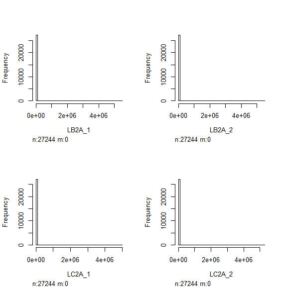

Most of our genes are clustered around the origin. However, a few highly expressed genes are shifting the scale of the histogram so greatly that we cannot see anything. Let's remove these outliers from our histograms:

<pre style="color: silver; background: black;">summary(sampleTable[,2:5])
 <strong>    LB2A_1            LB2A_2            LC2A_1            LC2A_2       
 Min.   :      0   Min.   :      0   Min.   :      0   Min.   :      0  
 1st Qu.:      0   1st Qu.:      0   1st Qu.:      0   1st Qu.:      0  
 Median :     11   Median :     11   Median :     10   Median :     10  
 Mean   :    980   Mean   :    958   Mean   :    955   Mean   :    973  
 3rd Qu.:    105   3rd Qu.:    103   3rd Qu.:     98   3rd Qu.:     99  
 Max.   :5429730   Max.   :5461036   Max.   :4939489   Max.   :5224203  </strong></pre>
 
 All four samples have similar distributions. It can be clearly seen that the maxima are outliers. Let's plot our histograms with a cut-off expression count around 2000 (double the mean):
 
<pre style="color: silver; background: black;">under_2000 = sampleTable[,2:5]<2000
dim(under_2000)
<strong>[1] 27244     4</strong>
head(under_2000)
<strong>     LB2A_1 LB2A_2 LC2A_1 LC2A_2
[1,]   TRUE   TRUE   TRUE   TRUE
[2,]   TRUE   TRUE   TRUE   TRUE
[3,]   TRUE   TRUE   TRUE   TRUE
[4,]   TRUE   TRUE   TRUE   TRUE
[5,]   TRUE   TRUE   TRUE   TRUE
[6,]   TRUE   TRUE   TRUE   TRUE</strong>
for(i in 2:5){hist(sampleTable[under_2000[,i-1],i])}</pre>
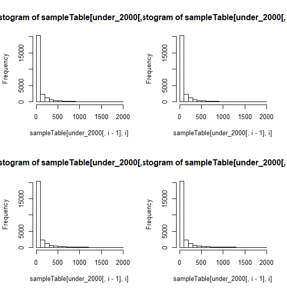

The data fits a negative binomial curve! Because the negative binomial curve is a probability distribution, should we create two separate curves (one for each condition) we can then compare the probabilities of a gene's count from one condition to the other. To fit the negative binomial curve, we need to know the negative binomial <i>function</i>, which is:

While this seems confusing, it's actually common sense! The negative binomial interprets only binary events, or more simply put, events with only two possible outcomes. Most commonly those outcomes are success and failure. There is one main assumption made in this model: the outcome of each individual event does not affect the outcome of succeeding events. That is, the probability of success is the same for every single event, regardless if the previous event was a success or a failure. We will call this probability of success <i>p</i>. Suppose we now wanted to estimate the probability that we will have A successes and B failures in C tries with a probability of success <i>p</i>. Let's suppose that we are flipping an unfair coin with a probability of heads being 0.3. We want to know the probability of the flip being heads 2 times in 4 flips. We know from <a href="https://people.richland.edu/james/lecture/m170/ch05-rul.html">probability rules</a> that the answer is:

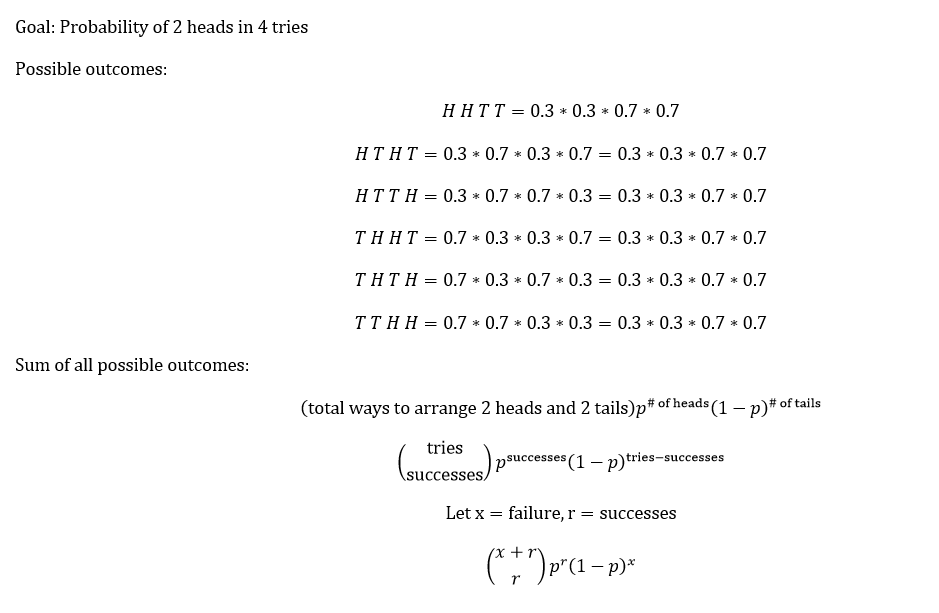

Our equation does not exactly match the model. This is because the model also calculates the probability of success on the final try! For us that means <i>r = 3</i> and we're taking our probability of 2 successes in 4 tries and simply adding a 3rd success on the fifth try. That is:

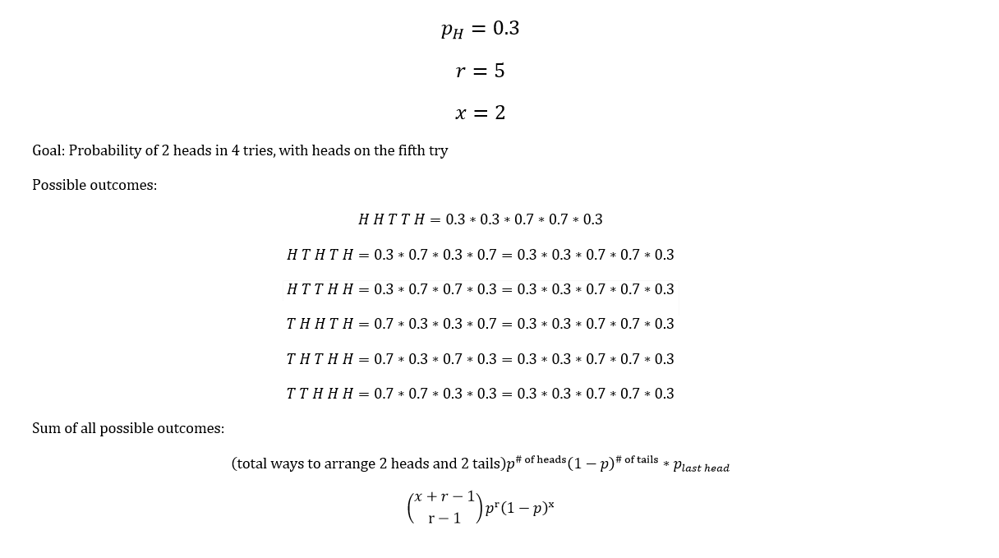

<h3 id="how_deseq2_works_2">Estimating true transcriptome size</h3>

We now have the negative binomial model! But how does this relate to our expression data? The negative binomial model outputs probability, but we only have raw counts. We could divide the raw counts of each sample by the total number of counts in that sample, creating the percentage of the transcriptome for each gene in each sample. This is a good idea, but we expect samples with up-regulation to have larger transcriptomes. Therefore, if we divide each sample by its own transcriptome size, the percentages may be the same across samples in which there actually was significant up-regulation! Therefore, we want to create a metric which is the approximate <i>true control</i> transcriptome size. This metric would, in theory, be the <i>expected</i> size of the control transcriptome. If we now divide our sample counts by the true control transcriptome then our value is the percentage of the control transcriptome for which the gene's expression would account. This would produce higher values for up-regulated transcriptomes and not affect the value of control transcriptomes very greatly. Furthermore, with a standardized transcriptome size, each gene value in our counts is now a measurement of how many successes (mapped reads) we expect for a given gene in a given condition in n (the total size of the transcriptome) tries. We have a true negative binomial distribution! This procedure is called "estimating size factors".

This is the first step in the DESeq procedure, so let's review it in detail by clicking on "estimateSizeFactors" in the DESeq vignette:

<pre style="color: silver; background: black;">
estimateSizeFactors {DESeq2}	R Documentation
Estimate the size factors for a DESeqDataSet

<strong>Description</strong>

<em>This function estimates the size factors using the "median ratio method" described by Equation 5 in Anders and Huber (2010). The 
estimated size factors can be accessed using the accessor function sizeFactors. Alternative library size estimators can also be 
supplied using the assignment function sizeFactors<-.</em>

<strong>Usage</strong>

## S4 method for signature 'DESeqDataSet'
estimateSizeFactors(object, type = c("ratio",
  "poscounts", "iterate"), locfunc = stats::median, geoMeans, controlGenes,
  normMatrix)
<strong>Arguments</strong>

object		a DESeqDataSet
type		Method for estimation: either "ratio", "poscounts", or "iterate". "ratio" uses the standard median ratio method 
		introduced in DESeq. The size factor is the median ratio of the sample over a "pseudosample": for each gene, the 
		geometric mean of all samples. "poscounts" and "iterate" offer alternative estimators, which can be used even when all 
		genes contain a sample with a zero (a problem for the default method, as the geometric mean becomes zero, and the 
		ratio undefined). The "poscounts" estimator deals with a gene with some zeros, by calculating a modified geometric 
		mean by taking the n-th root of the product of the non-zero counts. This evolved out of use cases with Paul McMurdie's 
		phyloseq package for metagenomic samples. The "iterate" estimator iterates between estimating the dispersion with a 
		design of ~1, and finding a size factor vector by numerically optimizing the likelihood of the ~1 model.
locfunc		a function to compute a location for a sample. By default, the median is used. However, especially for low counts, the 
		shorth function from the genefilter package may give better results.
geoMeans	by default this is not provided and the geometric means of the counts are calculated within the function. A vector of 
		geometric means from another count matrix can be provided for a "frozen" size factor calculation
controlGenes	optional, numeric or logical index vector specifying those genes to use for size factor estimation (e.g. housekeeping 
		or spike-in genes)
normMatrix	optional, a matrix of normalization factors which do not yet control for library size. Note that this argument should 
		not be used (and will be ignored) if the dds object was created using tximport. In this case, the information in 
		assays(dds)[["avgTxLength"]] is automatically used to create appropriate normalization factors. Providing normMatrix 
		will estimate size factors on the count matrix divided by normMatrix and store the product of the size factors and 
		normMatrix as normalizationFactors. It is recommended to divide out the row-wise geometric mean of normMatrix so the 
		rows roughly are centered on 1.
<strong>Details</strong>

Typically, the function is called with the idiom:

dds <- estimateSizeFactors(dds)</pre>

Because the only argument of the size factors estimation is our data frame we do not need to worry about all of the arguments that the function extracts from our data. However, if we are using this tool in our analysis it is important that we understand what it is! Each of our samples have a different <a href="https://en.wikipedia.org/wiki/Coverage_(genetics)">sequencing depth</a>. We expect samples with greater coverage to have, on average, a higher number of counts per gene, regardless if the those genes are actually up-regulated. We can remedy this by approximating our reads as if they were drawn from samples of all equal sequencing depths. One way to do this is creating a metric for the size of each transcriptome and comparing those sizes across transcriptomes. We then find constants for each transcriptome that when multiplied by the size of the respective transciptome yields the average size of all transcriptomes. We are going to walk through the math of this here, you may view the paper from which this algebraic result derives <a href="https://www.ncbi.nlm.nih.gov/pmc/articles/PMC3918003/">here</a>:

Before we begin, there are a few assumptions we make. The first is that we have sampled the same genes in every single sample. The second is that the coverage of each sample is the size of its transcriptome. That is, we have successfully read every single transcript in the sample. 

Our first step is to find a way to determine the average expression of each gene for a given condition across all samples fitting that condition. Our result is this:

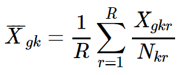

Where k ∈ {<b>Z</b>+}: 1 &le; k &le; K, g ∈ {<b>Z</b>+}: 1 &le; g &le; G, and r ∈ {<b>Z</b>+}: 1 &le; r &le; R  . Each k is the index of a separate condition (so for us, we have two conditions -- our control is condition 1 (k = 1) and our thermal stress is condition 2 (k = 2)) and each g is the index of a separate gene (if we have 25000 unique genes then g = 1, 2, 3 . . . 250000) and each r is the index of a separate replicate (we have 2 replicates per sample, so r = 1, 2). R, G, and K are the total number of replicates, genes sampled, and conditions, respectively.

Let's break down this equation: The left-hand side simply states that we are calculating an average expression (X-bar) of a certain gene given across samples with the same condition, We will start with the variables on the right hand side. Xgkr is the count of our gene in replicate r in condition k and Nkr is the total number of reads (counts across all genes) we sequenced in our replicte in condition k. Therefore, the fraction Xgkr&frasl;Nkr is the percentage of the total transcriptome of our sample for which gene g accounts. Now we move to our summation: we see we are calculating the percentage described prior for all of our replicaten in condition k and adding them together. By dividing this number by the total number of replicates <b>R</b> we simply have the average percentage of the transcriptome for which gene g accounts in condition k. We perform this operation for all genes in all replicates in all conditions. Now we have the average proportions of each gene per condition. We need to relate these averages across conditions. That is, we need to determine the relative increase or decrease of each genes percentage compared to the control group. For each gene this can be done simply by dividing the average percentage of each gene  in the control (the equation above for k = 1) by the percentage of the average percentage of the gene in the condition (the equation above for k > 1). We will call this result <b>&tau;</b>g. Notice that this result is 1 for every single gene in the control. Should the expression profiles across conditions be exact this result will be 1 for every gene, period. Genes which are down-regulated on average will have values greater than 1, whereas genes which are up-regulated on average will have values between 0 and 1. Notice that this metric is unaffected by the transcriptome size. We can determine if on average the <i>transcriptome</i> of a condition is up or downregulated according to condition using the values calculated prior. Suppose a condition has a <b>&tau;</b>g metric of 0.5 for all genes. That is, its genes are on average up-regulated by a factor of 2. Well then the condition's transcriptome would be expected to be twice as large! Knowing this, we could make this condition's transcriptome size equal with the control by scaling all counts by a factor of 0.5 (think about it, it's true!), giving us an effective normalization. You may be tempted to take the average of all <b>W</b>i. Let's take a look at our distributions to see if this is a good or bad idea (this code will be presented with no explanation, do not focus too much on getting through it right now):

<pre style="color: silver; background: black;">plot(density(sampleTable[,2]),main="Distribution of Counts")
for (i in 2:5){lines(density(sampleTable[,i]))}

dim(sampleTable)
<strong>[1] 27244     5</strong></pre>
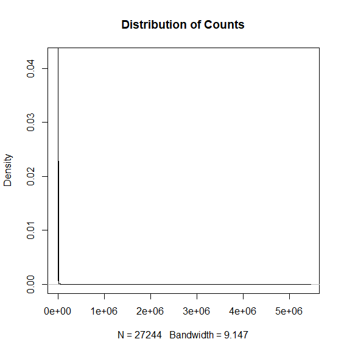

R scales its axes automatically by the given minima and maxima. Therefore, we know that there are counts up to 5,000,000 and we have 27244 genes. The vast majority of our counts are near 0. Suppose that all of our counts were 0 except for one count, which was 5,000,000. Now we take the average of our counts (5,000,000/27,244) and receive a value of 183.5. We therefore say that given our samples, the expected count is 183.5 . . . but look at the distribution! The expected count should be 0 or very near to it! This is the danger in taking the average. Therefore, we do not want to take the average for our objective stated before the coding chunk. What if instead we took the <i>median</i> of our counts? We see that for our data the median <i>is</i> a much better capture of the distributon than the mean! Let's now make our scaled transcriptomes (notice the control has a <b>&tau;</b> value of 1, this formula also only shows for two conditions, but an infinite number are possible):

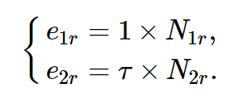

The last step has the most complicated formula but is the simplest in meaning:

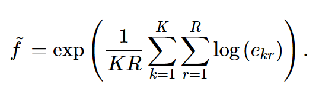

The <a href="http://mathworld.wolfram.com/DoubleSeries.html">double summation</a> is the sum of the log of all our scaled transcriptome sizes. Because ln(a) + ln(b) = ln(ab), we are taking the log of the <i>product</i> of all our transcriptome sizes. This is quite clever, but suppose that each un-scaled transcriptome had the same exact expression profile (and size) as the control. Notice:

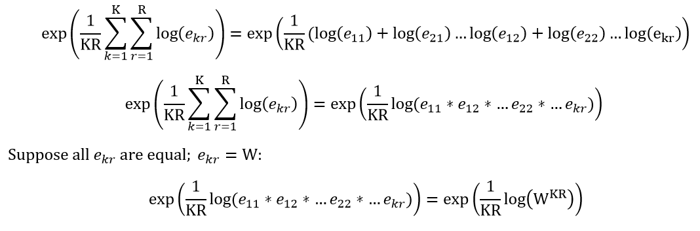

By the exponential-log identity:

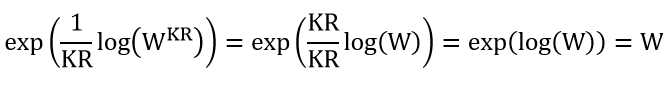

Our result is simply the size of all our transcriptomes! This is just the average size of all our scaled transcriptomes! We finish our normalization by dividing all of our real transcriptome sizes by the average size of our scaled transcriptomes. You may be wondering why this much work is worth the trouble. R handls these computations in a matter of seconds, so it not as troublesome as it appears! Secondly, we saw the range of our un-normalized counts in the density plot from 0 to 5 million. The range was so great as to hinder us from determining if the distribution fit a known model. Let's do a very simple (and common) normalization of our counts by taking the log2 transform of it. Lastly, we'll visualize our distribution:

<pre style="color: silver; background: black;">sampleTable[,2:5] = log2(sampleTable[,2:5]+1)
plot(density(sampleTable[,2]),main="Distribution of Counts Improper Normalization")</pre>

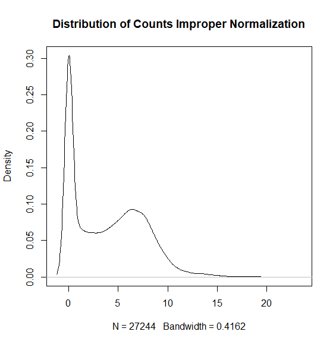

The distribution is much more readily accessible now. However, this is not the true distribution of the data! The log2 transform, while common, aggressively shifts distributions toward 0 (read <a href="https://en.wikipedia.org/wiki/Natural_logarithm">here</a> if you're curious about the details). For very closely related samples where up-regulation or down-regulation may be more nuanced something as aggressive as the log2 transform may erase the differential expression. We avoid this dilemma by normalizing via scalars rather than functions.

<h3 id="how_deseq2_works_3">Reparameterizing the negative binomial distribution</h3>
In order to assess the statistical significance of our findings to generate results we need to fit our negative binomial distribution. We need to know the probability of read being mapped, the total number of reads that were attempted to be mapped, and the total number of reads which succeeded in being mapped. It may seem tempting to use the information we have, i.e., take our transcriptome size as the total number of tries to find the probability. After further thought, the logic breaks down: We need to know the percentage of reads attempted to be mapped -- but all of our information are from reads which were successfully mapped! This also prevents us from determining our probability of success, as we cannot determine the number of failures. Let's instead try to write our distribution in variables we can actually measure -- the mean and variance. As stated before, the negative binomial distribution is binary. We will assign a success as a value of 1 and a failure as a value of 0. This way only successes will contribute to the mean (and to some extent, the variance). We can write the mean and <a href="https://en.wikipedia.org/wiki/Variance">variance</a> as functions of our probability of success and number of failures. Alternatively, we can write the mean and variance as the probabiliy of failure and number of successees. It does not matter which you use, but we will be using the former. The mean is:

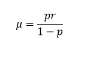

This becomes readily apparent when we think of it like this:

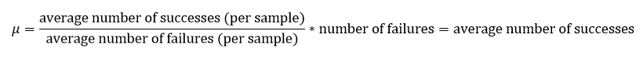

This works because the fracitonal component has the same units in both the numerator and denominator (tries per sample). These dimensions reduce to give us simple the number of successes we can expect per failure. Now, if we multiply by the number of failures we observed we get the average number of successes, not as a percentage. Because only successes contribute to the value of the function, the average number of successes is itself the mean.

Next we want to call the variance in these terms. Remember, the variance is how much we expect a sample to deviate from the average. Our equation is:

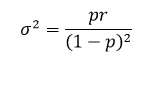

This becomes straight-forward when we think of it like this:

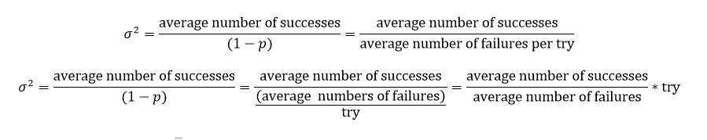

This formula describes the ratio of how many more times there is a success rather than a fail per try. Funny enough, this is the intuitive meaning behind the variance which often becomes abstract in other models. Now let's write our negative binomial distribution in terms of its mean and variance:

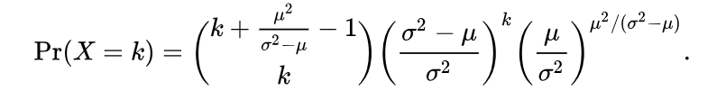

The next question we have is to determine the mean and variance for our data as accurately as we can. This is the next step in DESeq2, called "estimating dipsersion". Dispersion is just another term for variance. Let's have a look how DESeq2 determines the mean and variance (click on estimateDispersions):

<pre style="color: silver; background: black;">estimateDispersions {DESeq2}	R Documentation
Estimate the dispersions for a DESeqDataSet

<strong>Description</strong>

<em>This function obtains dispersion estimates for Negative Binomial distributed data.</em>

<strong>Usage</strong>

## S4 method for signature 'DESeqDataSet'
estimateDispersions(object, fitType = c("parametric",
  "local", "mean"), maxit = 100, quiet = FALSE, modelMatrix = NULL,
  minmu = 0.5)
<strong>Arguments</strong>

object		a DESeqDataSet
fitType		either "parametric", "local", or "mean" for the type of fitting of dispersions to the mean intensity.
parametric 	- fit a dispersion-mean relation of the form:
			dispersion = asymptDisp + extraPois / mean
			via a robust gamma-family GLM. The coefficients asymptDisp and extraPois are given in the attribute 	
			coefficients of the dispersionFunction of the object.
local 		- use the locfit package to fit a local regression of log dispersions over log base mean (normal scale means and 
			dispersions are input and output for dispersionFunction). The points are weighted by normalized mean count in 
			the local regression.
mean 		- use the mean of gene-wise dispersion estimates.
maxit		control parameter: maximum number of iterations to allow for convergence
quiet		whether to print messages at each step
modelMatrix	an optional matrix which will be used for fitting the expected counts. by default, the model matrix is constructed 
		from design(object)
minmu		lower bound on the estimated count for fitting gene-wise dispersion
<strong>Details</strong>

Typically the function is called with the idiom:

dds <- estimateDispersions(dds)

The fitting proceeds as follows: for each gene, an estimate of the dispersion is found which maximizes the Cox Reid-adjusted profile likelihood (the methods of Cox Reid-adjusted profile likelihood maximization for estimation of dispersion in RNA-Seq data were developed by McCarthy, et al. (2012), first implemented in the edgeR package in 2010); a trend line capturing the dispersion-mean relationship is fit to the maximum likelihood estimates; a normal prior is determined for the log dispersion estimates centered on the predicted value from the trended fit with variance equal to the difference between the observed variance of the log dispersion estimates and the expected sampling variance; finally maximum a posteriori dispersion estimates are returned. This final dispersion parameter is used in subsequent tests. The final dispersion estimates can be accessed from an object using dispersions. The fitted dispersion-mean relationship is also used in varianceStabilizingTransformation. All of the intermediate values (gene-wise dispersion estimates, fitted dispersion estimates from the trended fit, etc.) are stored in mcols(dds), with information about these columns in mcols(mcols(dds)).

The log normal prior on the dispersion parameter has been proposed by Wu, et al. (2012) and is also implemented in the DSS package.

In DESeq2, the dispersion estimation procedure described above replaces the different methods of dispersion from the previous version of the DESeq package.

estimateDispersions checks for the case of an analysis with as many samples as the number of coefficients to fit, and will temporarily substitute a design formula ~ 1 for the purposes of dispersion estimation. Note that analysis of designs without replicates will be removed in the Oct 2018 release: DESeq2 v1.22.0, after which DESeq2 will give an error.

The lower-level functions called by estimateDispersions are: estimateDispersionsGeneEst, estimateDispersionsFit, and estimateDispersionsMAP.</pre>

We see that the only required argument on our end is the "object" argument. DESeq2 will estimate the dispersions using all three fits and select the most robust option. Let's investigate the procedure:

A note: While I strongly encourage all readers to continue along, those without study to at least linear algebra and multivariate calculus are at a distinct disadvantage in the explanation of the "estimateDispersions" function. If this applies to you, feel free to skip this section. For all others, continue on:

<h3 id="how_deseq2_works_4">Parameter estimation theory: mean and variance</h3>
The first sentence informs us that DESeq2 calculates an estimate of the dispersion for each gene, and combines those estimates to create the dispersion estimate for the model. Here is where we see the fit types come into play. DEseq2 says it maximizes the <a href="https://www.nuffield.ox.ac.uk/users/cox/cox223.pdf">Cox Reid-adjusted profile likelihood</a> to determine the variance per gene. Before we consider that. Let's review profile likelihoods:

Likelihood functions and probability distributions are one and the same. We will switch to using "likelihood function" now in place of "distribution". The likelihood function is called such because if we evaluate some value along its x-axis the result is the <i>likelihood</i> that the x-value in question appears in our sample. Thus, for us, we see that our negative binomial distribution is a likelihood function with arguments x, &mu;, and &sigma;2. That is:

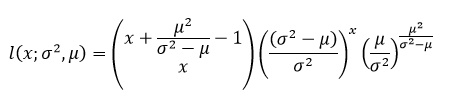

Which means the likelihood of x, given &mu; and &sigma;2 is (function).

Suppose we had an experimentally deteremined value of &mu; in which we were very confident. We can hold &mu; constant and maximize the likelihood function with respect to &sigma;2 to determine the <i>maximum likelihood estimate</i> of &sigma;2. For those of you scratching your heads, I recommend reading about <a href="https://en.wikipedia.org/wiki/Derivative">derivatives</a>, as a concrete understanding of calculus is somewhat necessary for the bioinformatician. Now, should we calculuate the partial derivative of the likelihood function with respect to &sigma;2 we will encounter a very complex process with <a href="https://en.wikipedia.org/wiki/Product_rule">product rules</a> and <a href="https://en.wikipedia.org/wiki/Quotient_rule">quotient rules</a>. We do not want that. We know that the function log(x) is a <a href="https://en.wikipedia.org/wiki/Monotonic_function">monotone</a> map of <b>R</b>2. All this means is that for any ordered set of numbers (x), log(x) will increase if x increases and decrease if x decreases. Therefore, if we have a function <b>X</b>, and transform it via log to log(<b>X</b>), their >a href="https://en.wikipedia.org/wiki/Maxima_and_minima">maxima</a> will appear at the same value of <b>X</b>. Therefore, we can calculate the best estimate of our variable by finding the maximum of the log-likelihood function:

<b><strong><u>DO NOT PERFORM THESE CALCULATIONS -- LOOK AND SCROLL. 
	THERE IS A MUCH BETTER ALTERNATIVE -- THIS IS HERE TO DEMONSTRATE A POINT</b></strong></u>

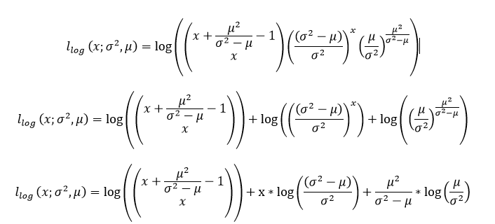

We replace the binomial coefficient with its formula:

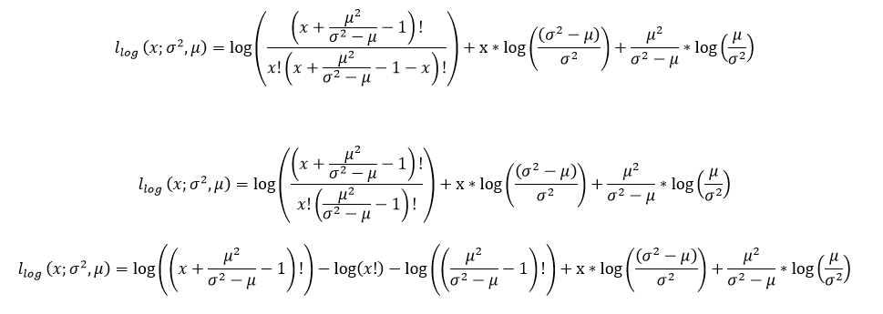

Because our domain is <b>R</b>, we need to replace the factorial with the <a href="https://en.wikipedia.org/wiki/Gamma_function">gamma function</a>:

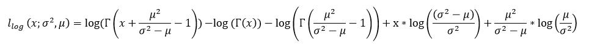

Our values are sufficiently large; we use <a href="https://en.wikipedia.org/wiki/Stirling%27s_approximation">Stirling's approximation</a> of the <a href="https://en.wikipedia.org/wiki/Gamma_function#The_log-gamma_function">log-gamma</a> function formula:

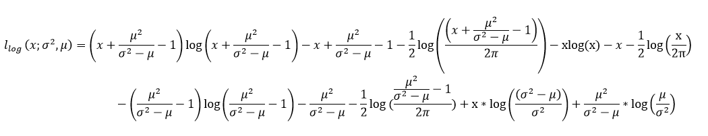
Combining like terms:

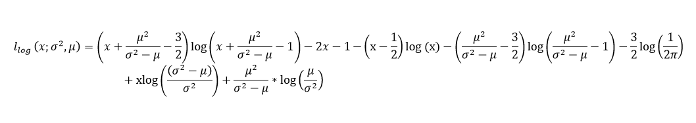

At last we can determine our maximum-likelihood estimates using partial derivatives. The maximum-likelihood estimate for the mean and variance are (although the variance has an exponent, we count the variance as order of 1):

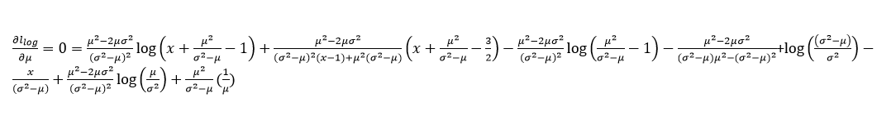

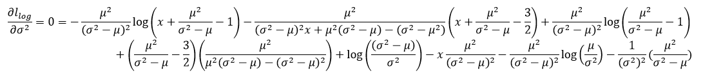

<b><u><strong>YOU SHOULD NOW BEGIN PAYING FULL ATTENTION</b></u></strong>

We solve these for the mean in terms of the variance and an observed value (x) and the variance in terms of the mean and an observed value(x), respectively. If this seems like far too much effort and somewhat improbable, you're absolutely correct. The algebraic difficulty of these partial differential equations far exceeds the amount of work we have to do to find our information. 

<h3 id="how_deseq2_works_5">Parameter estimation technique: mean and variance</h3>
We have thousands of trials if we view each gene as such. We can extract any general trends from the dispersion and mean of each gene and fit those trends to its own distribution. The mean is the average number of successes and the variance is the expected number of additional or fewer successes for a random trial squared. If the ratio of variance over the mean for each gene fits a distribution model, we can find the maximum-likelihood estimate of the variance over mean ratio.  Lastly, multiplying the variance-mean ratio by the actual mean of our data (in this case, the estimated transcriptome size determined earlier) will yield the variance of the data. Let's create a a histogram of the variance/mean ratio:

<pre style="color: silver; background: black;">distribution = vector(length=nrow(sampleTable))
for (i in 1:nrow(sampleTable)){distribution[i]=var(t(sampleTable[i,2:5]))/mean(t(sampleTable[i,2:5]))}
distribution = as.matrix(distribution,ncol=1)
head(distribution)
<strong>           [,1]
[1,]  5.4224422
[2,]  2.4444444
[3,]        NaN
[4,]  4.3211983
[5,]  0.4942529
[6,] 12.5918367</strong>
##remove Nas
distribution = distribution[complete.cases(distribution),]
summary(distribution)
    <strong>Min.  1st Qu.   Median     Mean  3rd Qu.     Max. 
    0.00     0.75     2.10    54.81     8.05 42314.36 </strong>
##let's take only values below 100
under_100 = distribution < 100
length(distribution)
<strong>[1] 19204</strong>
hist(distribution)</pre>

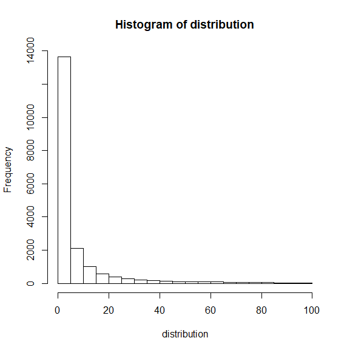

This distribution looks a lot like the negative binomial distribution. But our bins are too large. Let's make the bins smaller and see:
<pre style="color: silver; background: black;">
hist(distribution,breaks=1000)</pre>

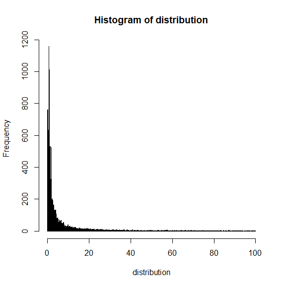

The spike being slightly to the right of 0, the bin at 0 presenting symmetry, and the steepness of the descent tells us that this is the (mostly) right-hand side of the <a href="https://en.wikipedia.org/wiki/Normal_distribution">normal distribution</a>. Truthfully, the steepness of the curve is the giveaway. Notice the gradual descent of the negative binomial distribution when <a href="https://en.wikipedia.org/wiki/Negative_binomial_distribution#/media/File:Negbinomial.gif">r = 1</a>. Knowing that our variance-mean ratio is normally distributed, we are going to repeat the process of creating the maximum-likelihood estimate with the normal distribution equation. The derivation of the equation is much beyond the scope of this tutorial. Therefore, unlike the negative binomial distribution, its derivation will not be included:

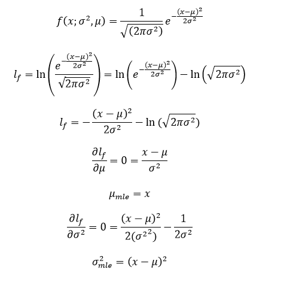

These results make sense. For a normal distribution the mean has the highest likelihood. Therefore, given a variance, the mean maximum-likelihood estimate would be greatest when it equals x. Likewise, the variance is how much we expect x to deviate from the mean. Therefore, given if we know x and have calculuated a mean, the normal distribution will fit x the greatest when the distance of x from the mean is the variance. 

DESeq2 calculates the variance-mean ratio of the dataset by approximating the variance-mean ratios for each gene given a normal distribution. You may think it as simple as finding the maximum-likelihood estimates. However, the partial differential equations have <a href="https://en.wikipedia.org/wiki/Second_derivative">second-order behavior</a>. That is, even though we have found a maximum for the given data, <i>the likelihood for the given values is expected to move in accordance with its second derivative</i>. Our actual likelihood for the given data is thus slightly beneath the maximum, leaving room for improvement. If you are unsure of the theory behind this, read about <a href="https://en.wikipedia.org/wiki/Acceleration">acceleration</a> for insight. Let's see how much our parameters are expected to move:

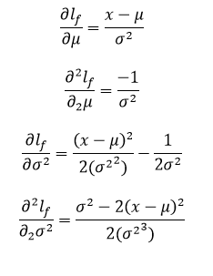

Therefore, at our maximum-likelihod estimate, we expect the <b>likelihood itself</b> to change by -1/(variance) for the given data. We have maximized the data, but the true likelihood is more complex than only the first-order behavior. We have all of the understanding laid out for the Cox Reid-Adjusted Profile Likelihood. Which we will cover next: 

<h3 id="how_deseq2_works_6">Cox Reid Adjusted Likelihood</h3>
The Cox Reid-Adjusted Profile Likelihood is an algorithm for generating more accurate estimations of parameters in statistical modeling.The parameters fit into two categories: &psi;, the parameters of interest, and &phi;, all other parameters (known as nuisance parameters). Furthermore, the likelihood of &psi; is the value of the likelihood function given &phi; and a set of observations. We call the value of the log-likelihood function with a &psi; of our choosing given &phi; and a set of observations <i>y</i> the log-likelihood profile of &psi;:

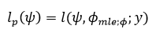

Suppose instead that we define the nuisance parameters as a function of &psi; and all parameters which are orthogonal to it by the <a href="https://en.wikipedia.org/wiki/Fisher_information_metric">Fisher metric</a>, &lambda;. Therefore:

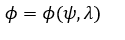

Such that for &psi; and all &lambda;:

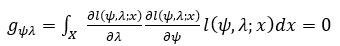

Let's take a moment to think about why a value of 0 for the Fisher metric creates orthogonal pairings.

We know that the integral of our likelihood function of all possible values of x is equal to 1. Let's consider a few scenarios:
Because the variables are defined, we know that neither of the partial derivatives are 0 (the derivative of a first-order variable is 1). Suppose that the derivatives for both are positive for all x, then our final answer will be a positive number. Likewise, if both derivatives are negative for all x our final answer will be a positive number. This means that there must be some values of x for which the first partial derivative is positive and the second is negative. Should this be the case for all x then the answer will be a negative value. Therefore, there must be a balance that for some x that one derivative is positive and the other negative and some other x that both derivatives are negative or positive. For an answer of 0 the integral over values of x where both are negative or positive is <i>exactly equal</i> to the integral over values of x where one is negative and one is positive. If we think of the inside of the integral as a distribution of its own, that is:

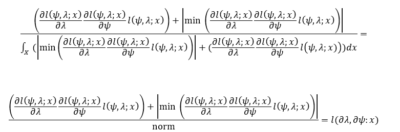

then there is an exactly 50% chance that the derivatives move together or in opposite directions. That is:

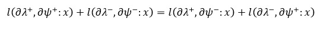

From this we can safely assert that they are independent of one another, and the behavior of one does not influence the behavior of the other. Thus, for Fisher metrics of 0 the indices are orthogonal. You may be wondering why we have added in the minimum of the inside of the integral. The integral may have negative values, which makes no physical sense in a likelihood model! Therefore, we shift the entire distribution up by its greatest negative value so that all values are above 0 (this also prevents the norm from creating a division by 0). Therefore, in our parameterization:

we parametrize our nuisance parameters as a function of our parameter of interest and all parameters whose behavior do not change the parameter of interest. If you are wondering why this is so important, suppose we determine are attempting to determine the maximum likelihood of &psi; for given &phi; where &psi; is a function of &phi;. First, we need to determine the maximum likelihood of &phi; given what we think &psi; is. Because &psi; is a function of &phi;, when we determine the maximum likelihood of &phi; we have just changed the value of &psi;! As long as &psi; is a function of &phi; we have no way to assess the likelihood of our static, chosen &psi;. This is why we need to reparameterize our nuisance parameters such that it is composed of the set of all parameters which will not interfere with the likelihood of our parameter of interest. With our parameterization, the Cox Reid-Adjusted Profile Likelihood is:

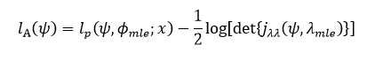

Where &lambda;mle is the maximum-likelihood estimate of the orthogonal nusiance parameters given observations <i>x</i> and our guess for &psi;, and variables are as otherwise described. The variable <i>j&lambda;&lambda;(&psi;,&lambda;)</i> is an n by n matrix (n being the number of lambdas) where the (r,s)th entry is:

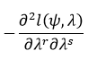

Let's dig a little deeper into this formula. First, the term:

may be thought of as how the likelihood changes with &lambda;r as we account for the influence of &lambda;s on &lambda;r. The matrix <i>j&lambda;&lambda;</i> then accounts for the way in which each parameter affects the likelihood while accounting for how the parameter itself is influenced with &psi; remaining constant (as &psi; and all &lambda; are orthogonal, this would not work if we could not hold &psi; constant!). If we view the matrix as an n dimensional vector space with each column, s, representing how the likelihood changes with the parameter &lambda;s and each row, r, representing how the parameter &lambda;s is influenced by &lambda;r. How the likelihood changes in total acccording to &lambda;s is described by taking the entire column s as a vector-function (each r representing a different axis). Note that the columns are not necessarily orthogonal. However, if we can find the total change along each axis, we can then simply multiply those changes across each axis to get the volume represented by the matrix. If you had read the acceleration page linked earlier then you know that the volume calculation is the <a href="https://en.wikipedia.org/wiki/Integral">total change</a> in the likelihood at the maximum. Lucky for us, the <a href="https://en.wikipedia.org/wiki/Determinant#Definition">determinant</a> is the signed area of a matrix. That is, given our n-dimensional vector space represented by our matrix, the determinant represents exactly as described prior -- the volume associated with the change alongisde each axis given the vectors in the matrix. Notice that the matrix is symmetric along its diagonal. This means that each value is actually repeated twice, and we have doubled the length of the change along each axis! This is a simple fix, we can simply cut the total volume of our matrix by half (as every side may be represnted as 2n) to calculate the true change of the likelihood at the maximum. 

You may be wondering why we are taking the log of the determinant when the values in the matrix are calculated based on the log-likelihood, giving us a double log where you may not think one is needed. However, observe the behavior when we take the log of the volume of a cube:

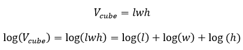

We get the individual changes associated with each side! Now suppose that we place our l, w, and h along the x, y, and z axes and place them in a matrix such that the first column of the matrix represents x, the second column in the matrix represents y, and the final column in the matrix represents z. Each row represents a vector. We can represent our cube as:

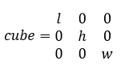

Now let's calculate the volume of our cube and take its log:

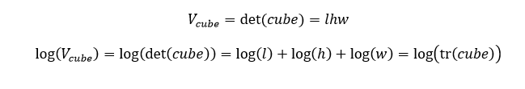

Where <b>tr</b> is the <a href="https://en.wikipedia.org/wiki/Trace_(linear_algebra)">trace</a>. This identity holds for any matrix symmetric along its diagonal (I'll let you ponder why this is so), which we have. You may be wondering why this is advantageous. There are two main reasons: First, imagine that you had 20 or 30 nuisance parameters in a very large model. While software like R can calculate the determinant of large matrices, they cannot calculate abstract derivatives! Therefore, you will have to determine each first and second derivative by hand. Accounting for the symmetry, that is 200 to 450 derivatives! Notice for us:

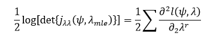

Which, counting both first and second derivatives is only 40 or 60 for the example prior. Second, this is not an exact calculation! The adjusted-likelihood is a better approximation of the true likelihood, and it <i>itself</i> is meant to be maximized. Simply put, we guess a value of &psi; and calculate the adjusted likelihood. We then guess another value of &psi; and calculate the adjusted likelihood again. We do this in very small incremenetal changes to &psi; until we reach a point where if we decrease <i>or</i> increase &psi; the adjusted likelihood decreases.

Lastly, because we know we're at a maximum for the likelihood-function in our calcaulations both the first and <a href="https://en.wikipedia.org/wiki/Derivative_test#Second_derivative_test_(single_variable)">second derivatives must be negative</a>. Because the determinant is signed this would have us taking the log of a negative value (which is an <a href="https://en.wikipedia.org/wiki/Imaginary_unit">imaginary</a>). Because of this the negative derivative is taken, resulting in the absolute value of the expected change. Again, because we know that all change must be negative we can simply subtract the absolute value of the expected change from our likelihood estimate. We repeat this process until we have found the inflection point of the adjusted likelihood. If you are wondering why we cannot simply maximize the adjusted likelihood function: the values of &phi;mle change with each guess of &psi;, so no two adjusted-likelihood functions are identical! There is a tradeoff here as the adjusted-likelihood can only maximize the parameters of interest. You cannot calculate the most likely parameter of interest using the adjusted-likelihood and then the nuisance parameters because the adjusted-likelihood of the nuisance parameters requires the parameters of interest to change. 

<h3 id="how_deseq2_works_7">Estimating variance with CRAL</h3>

The Cox Reid works simply for the normal distribution as its two parameters, &mu; and &sigma;2 are orthogonal. Therefore, we go about calculating our maximum-likely estimate for the variance using the mean as the only nuisance parameter. That gives us:

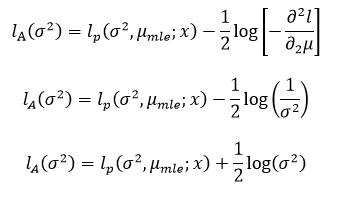

Which is much simpler than what we had modeling the dispersion as a negative binomial distribution (also, interestingly enough, our likelihood is a little bit higher than expected)!

We use the Cox Reid-adjusted profile-likelihood to calculate our variance-mean ratio according to a normal distribution for each gene, also calculating the actual variance-mean ratio for that gene. We perform a <a href="https://en.wikipedia.org/wiki/Linear_regression">linear regression</a> on the maximum-likelihood variance-mean ratios, with the mean along the x-axis and the variance along the y-axis. Now, whenever we look at a single gene its mean can be taken and we consult our linear regression, which will point us to its expected. Then a normal distribution is created which maximizes the likelihood of all of our sample gene's variance-mean ratios. To do this, a few steps are followed:

1. We take the mean of <i>all</i> the sample gene indiviudal means
2. We use this mean with our linear regression to determine the expected variance
3. The mean of the normal distribution (that we are creating now) is set to the variance-mean ratio from steps 1 and 2
4. The variance is set to the average of the difference of each experimental variance-mean ratio from the value in step 3, squared (the formal definition)

Lastly, we use <a href="https://brilliant.org/wiki/bayes-theorem/">Bayes' Theorem</a> to assess the <a href="https://en.wikipedia.org/wiki/Posterior_probability">posterior probability</a> of our model, which we maximize to find our final most-likely variance-mean ratio.

You may see in the vignette that the information generated from this process (our theoretical variance) has more use than in creating our negative binomial distribution. Particularly, the variance-mean linear regression has the option to be used in the <a href="https://en.wikipedia.org/wiki/Variance-stabilizing_transformation">variance-stabilizing transformation</a> step. Despite its fancy name, variance-stabilizing transformation is quite simple. The theory is that for a large set number of observations, X, we expect the extractable information from X to be the same every time we make a new set of X observations. The particular values of each X will not be the same, as X corresponds to the observation of a random event, but the <i>information</i> of X, i.e., its variance, mean, mode, should be the same each and every time we make X observations. The reason for this is that we expect a random event to be un-influenced by anything but its parameters. If the parameters are the same for our X observations every time and X is sufficiently large, we expect the same distribution!

Now consider the samples of our genes. We have considered each gene as a separate distribution, but the distribution type fitting each gene to be the same. We also know that each gene has the same number of observations, X=4, and two parameters which vary (mean and variance). X is not sufficiently large, but pretend that it is. We know that one parameter is a function of the other (as evidence by our linear regression). Our parameters are:

Mean: varies 
Number of observation: same for each gene 
Variance: function of gene-mean 

Therefore, should two genes have the same mean, they should also have the same variance. That is, they belong to the same exact distribution model. However, this is not the case! There are a variety of reasons for this, the largest culprits being <a href="http://www.molmine.com/magma/global_analysis/batch_effect.html">batch effectws</a>, technological bias, and human error. We use our linear regression to transform the data as if it were an ideally identically distributed random variable with the following steps:

1. Calculate a gene-mean
2. Use the linear regression to determine the ideal variance of the gene
3. Transform the counts of the gene such that its mean does not change and the variance is the ideal variance

Step 3 is carried out via a function created using the linear regression. There are a <a href="https://www.stat.ncsu.edu/people/bloomfield/courses/ST762/slides/MD-02-2.pdf">variety of ways</a> to do this, but DESeq2 keeps theirs a baker's secret. 

<h3 id="how_deseq2_works_8">Calculating significance of findings </h3>
The final step in a standard DESeq2 analysis is the "nbinomWaldTest". We click on its page in the DESeq2 vignette and see:

<pre style="color: silver; background: black;">
<em>nbinomWaldTest {DESeq2}	R Documentation</em>
Wald test for the GLM coefficients

<strong>Description</strong>

<em>This function tests for significance of coefficients in a Negative Binomial GLM, using previously calculated sizeFactors (or normalizationFactors) and dispersion estimates. See DESeq for the GLM formula.</em>

<strong>Usage</strong>

nbinomWaldTest(object, betaPrior = FALSE, betaPriorVar, modelMatrix = NULL,
  modelMatrixType, betaTol = 1e-08, maxit = 100, useOptim = TRUE,
  quiet = FALSE, useT = FALSE, df, useQR = TRUE, minmu = 0.5)
<strong>Arguments</strong>

object			a DESeqDataSet
betaPrior		whether or not to put a zero-mean normal prior on the non-intercept coefficients
betaPriorVar		a vector with length equal to the number of model terms including the intercept. betaPriorVar gives the 
			variance of the prior on the sample betas on the log2 scale. if missing (default) this is estimated from the 
			data
modelMatrix		an optional matrix, typically this is set to NULL and created within the function
modelMatrixType		either "standard" or "expanded", which describe how the model matrix, X of the formula in DESeq, is formed. 
			"standard" is as created by model.matrix using the design formula. "expanded" includes an indicator variable 
			for each level of factors in addition to an intercept. betaPrior must be set to TRUE in order for expanded 
			model matrices to be fit.
betaTol			control parameter defining convergence
maxit			the maximum number of iterations to allow for convergence of the coefficient vector
useOptim		whether to use the native optim function on rows which do not converge within maxit
quiet			whether to print messages at each step
useT			whether to use a t-distribution as a null distribution, for significance testing of the Wald statistics. If 
			FALSE, a standard normal null distribution is used. See next argument df for information about which t is 
			used. If useT=TRUE then further calls to results will make use of mcols(object)$tDegreesFreedom that is stored 
			by nbinomWaldTest.
df			the degrees of freedom for the t-distribution. This can be of length 1 or the number of rows of object. If 
			this is not specified, the degrees of freedom will be set by the number of samples minus the number of columns 
			of the design matrix used for dispersion estimation. If "weights" are included in the assays(object), then the 
			sum of the weights is used in lieu of the number of samples.
useQR			whether to use the QR decomposition on the design matrix X while fitting the GLM
minmu			lower bound on the estimated count while fitting the GLM
<strnog>Details</strong>

The fitting proceeds as follows: standard maximum likelihood estimates for GLM coefficients (synonymous with "beta", "log2 fold 
change", "effect size") are calculated. Then, optionally, a zero-centered Normal prior distribution (betaPrior) is assumed for the 
coefficients other than the intercept.

Note that this posterior log2 fold change estimation is now not the default setting for nbinomWaldTest, as the standard workflow for 
coefficient shrinkage has moved to an additional function link{lfcShrink}.

For calculating Wald test p-values, the coefficients are scaled by their standard errors and then compared to a standard Normal 
distribution. The results function without any arguments will automatically perform a contrast of the last level of the last variable 
in the design formula over the first level. The contrast argument of the results function can be used to generate other comparisons.

The Wald test can be replaced with the nbinomLRT for an alternative test of significance.

Notes on the log2 fold change prior:

The variance of the prior distribution for each non-intercept coefficient is calculated using the observed distribution of the maximum 
likelihood coefficients. The final coefficients are then maximum a posteriori estimates using this prior (Tikhonov/ridge 
regularization). See below for details on the prior variance and the Methods section of the DESeq2 manuscript for more detail. The use 
of a prior has little effect on genes with high counts and helps to moderate the large spread in coefficients for genes with low 
counts.

The prior variance is calculated by matching the 0.05 upper quantile of the observed MLE coefficients to a zero-centered Normal 
distribution. In a change of methods since the 2014 paper, the weighted upper quantile is calculated using the wtd.quantile function 
from the Hmisc package. The weights are the inverse of the expected variance of log counts, so the inverse of 1/mu-bar + alpha_tr 
using the mean of normalized counts and the trended dispersion fit. The weighting ensures that noisy estimates of log fold changes 
from small count genes do not overly influence the calculation of the prior variance. See estimateBetaPriorVar. The final prior 
variance for a factor level is the average of the estimated prior variance over all contrasts of all levels of the factor.

When a log2 fold change prior is used (betaPrior=TRUE), then nbinomWaldTest will by default use expanded model matrices, as described 
in the modelMatrixType argument, unless this argument is used to override the default behavior. This ensures that log2 fold changes 
will be independent of the choice of reference level. In this case, the beta prior variance for each factor is calculated as the 
average of the mean squared maximum likelihood estimates for each level and every possible contrast.</pre>

Before we cover how DESeq2 calculates its Wald Test statistics we want to know what a <a href="https://en.wikipedia.org/wiki/Wald_test">Wald Test</a> is. But there is a hidden step separating our previous calculations and the Wald test: the determination of differentially expressed genes! 

DESeq2 does not actually use the distributions we have created to determine differentially expressed genes. Rather, the information from the likelihood models has been gradually utilized to transform our data such that technological bias and human error have been "removed" (whether this is removing these or encouraging them is up to you). Notice that we first transformed our data by dividing by an idealized transcriptome size, and next transformed our data by forcing <a href="https://en.wikipedia.org/wiki/Homoscedasticity">homoskedasticity</a> -- ensuring that data with the same mean have the same variance -- by taking information from our normal distributions and applying it to our counts. After we finish transforming our data with these steps DESeq2 determines which genes best fit a linear regression between classes (control = 0, treated = 1). The coefficient in the linear regression of each gene is the <a href="https://en.wikipedia.org/wiki/Fold_change">log2-fold change</a> of the gene between classes. 

The Wald Test allows us to determine the likelihood of the log2-fold change for each differentially expressed gene through the assu that the coefficient values follow a normal distribution. The normal distribution is created using the mean and variance of the coefficient values as parameters. However, not <i>all</i> of the coefficient values are used to determine the mean and variance. Because of the nature of differential expression, we expect genes with very high coefficients to most certainly be differentially expressed, as it would be rare for human error or technological bias to result in the appearance of dramatic up-regulation between classes. Therefore, if we subset our genes to those with very high coefficients and model the normal distribution after these we are creating a distribution most confidently based off of differentially expressed genes. To do this, DESeq2 takes genes with coefficients in the upper 0.05 quantile, i.e., genes with coefficients higher than 95% of all other genes, and fits a normal distribution such that its upper 0.05 quantile most closely matches our upper 0.05 quantile. All of the coefficients are then uniformly scaled such that the square of the difference of their <a href="https://en.wikipedia.org/wiki/Residual_(numerical_analysis)">residuals</a> are minimized. The procedure is as follows:

Suppose we have an idealized prior normal distribution as well as a collection of data said to fit that distribution. We notice that the values <i>x</i> and <i>y</i> appear in our data 13% and 28% of the time. However, our idealized prior has a likelihood of <i>x</i> and <i>y</i> as 15% and 27% respectively. There exists a scalar which when multiplied by <i>x</i> and <i>y</i> results in <i>x1</i> and <i>y1</i> whose likelihoods are 15% and 28.5%. Because we have multiplied both <i>x</i> and <i>y</i> by the same scalar, we have not changed the relationship between the two. Our square of differences before was:

<math>(15-13)2 + (28-27)2 = 5</math>

and now are:

<math>(15-15)2 + (28-28.5)2 = 0.025</math>

We've transformed our data in such a way that the information between its individual points has been maintained but its fit into a known model has increased. This is a very simple explanation of <a href="https://en.wikipedia.org/wiki/Tikhonov_regularization">Tikhonov regularization</a>, and is the method DESeq2 uses to transform the gene coefficients into a maximized fit of the prior distribution, making the posterior distribution. We are now ready for the Wald Test, which is in the form:

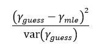

For us, &lambda;<i>guess</i> is the percentage of genes with a certain log-fold change, <b>A</b> and &lambda;<i>mle</i> is the percentage of genes with the log-fold change <b>A</b> according to the idealized normal distribution. DESeq2 does not actually use this statistic, however! The Wald Test is more a description of the process through which we transformed our coefficients. With our final coefficients, DESeq2 conducts a <a href="https://en.wikipedia.org/wiki/Likelihood-ratio_test">likelihood-ratio test</a> between our &lambda;<i>guess</i> and &lambda;<i>mle</i> (&lambda;<i>guess</i>&frasl;&lambda;<i>mle</i>). The value returned is subtracted from one, and there is our p-value.
	
Congratulations! You are an expert on DESeq2! Now let's use it!
